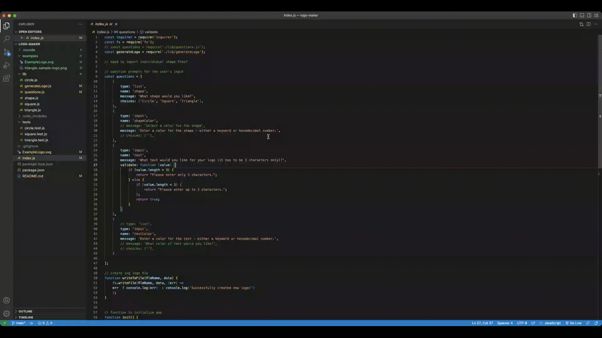

# Logo Generator

## Description
  This application was created to enable freelance web developers to generate simple logos without having to go through a graphic designer. It takes in user input - color, shape, and text, to generate a logo and save as an svg file.  

## Table of Contents
  - [Installation](#installation)
  - [Usage](#usage)
  - [Credits](#credits)
  - [Features](#features)
  - [Tests](#tests)
  - [License](#license)

  ## Installation
  Clone the respository from the repo in GitHub. Make sure you install Node.js and NPM on your computer. You will need to install the node package manager (NPM) using `npm init` and then the inquirer v8.2.4 module using `npm i inquirer@8.2.4`. Use `npm install` to install dependencies, and `npm install --save-dev-jest` to install Jest as a devDependency. 

  ## Usage
  You can find the walkthrough video here - [logo generator walkthrough video](https://drive.google.com/file/d/10rrPpqKq-rbmrdPNkO2JhKBC775jMrPP/view?usp=sharing)

  Start by opening the file in the terminal. Type `node index.js` and answer the series of questions about the type of logo you want. You will need to enter 3 characters for the logo text. Once all prompts have been answered, the new logo will be generated in the examples folder with the name 'ExampleLogo.svg'.

  

[triangle logo](./examples/triangle-sample-logo.png)

## Credits
 * classes - (https://developer.mozilla.org/en-US/docs/Web/JavaScript/Reference/Classes/extends)
 * svg - (https://developer.mozilla.org/en-US/docs/Web/SVG)
 
  

## Features
* Node.js
* NPM 
* NPM Inquirer
* Jest

## Tests 
Each shape (Circle, Square, and Triange) is tested for a render() method that returns a string for the corresponding SVG file matching color and text selection. Type `npm test` in the command line to run all the three tests.

## License
The project is licensed under MIT. For more information, please refer to the LICENSE in the repo.
  